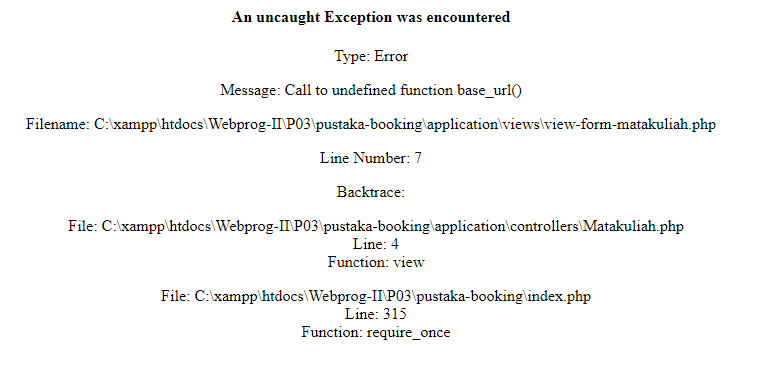

# Materi Pertemuan 3 pada matakuliah Web Programming II

## Berikut daftar perubahan dari **pertemuan 2** ke **pertemuan 3** :

- **Contoh 1** : Menambahkan file `Latihan1.php` pada `application/controllers`
Untuk Contoh 1 dapat anda akses disini [http://localhost/Webprog-II/P03/pustaka-booking/Latihan1](http://localhost/Webprog-II/P03/pustaka-booking/Latihan1)
<br>

- **Contoh 2** : Menambahkan file Model_latihan1.php pada `application/models` dan mengubah isi file `Latihan1.php` yang sudah dibuat.
Untuk Contoh 2 dapat anda akses disini [http://localhost/Webprog-II/P03/pustaka-booking/index.php/Latihan1/penjumlahan/2/6](http://localhost/Webprog-II/P03/pustaka-booking/index.php/Latihan1/penjumlahan/2/6)
<br>

- **Contoh 3** : Menambahkan file `view-latihan.php` pada `application/views` dan mengubah isi file `Latihan1.php` yang sudah dibuat.
Untuk Contoh 3 dapat anda akses disini [http://localhost/Webprog-II/P03/pustaka-booking/index.php/Latihan1/penjumlahan/2/6](http://localhost/Webprog-II/P03/pustaka-booking/index.php/Latihan1/penjumlahan/2/6)
<br>

- **Contoh 4** : Mengirimkan nilai dari controller ke view, Membuat file `view-form-matakuliah.php` pada `application/views`.
Membuat file `Matakuliah.php` pada `application/controllers`.
Membuat file `view-data-matakuliah.php` pada `application/views`.
Akses file dengan membuka url [http://localhost/Webprog-II/P03/pustaka-booking/matakuliah](http://localhost/Webprog-II/P03/pustaka-booking/matakuliah)

## Tahap Konfigurasi

- Menghilangkan `index.php` pada **index_page** di `application/config/config.php`

sebelum diubah :
```php
$config['index_page'] = 'index.php';
```

sesudah diubah :
```php
$config['index_page'] = '';
```

- Menambahkan file `.htaccess` pada folder `pustaka-booking` 

file berisikan :

```.htacess
RewriteEngine On
RewriteCond %{REQUEST_FILENAME} !-f
RewriteCond %{REQUEST_FILENAME} !-d
RewriteRule ^(.*)$ index.php/$1 [L]
```

Setelah melakukan konfigurasi, sekarang anda dapat mengakses file tanpa menggunakan **index.php** seperti [http://localhost/Webprog-II/P03/pustaka-booking/Latihan1/penjumlahan/2/6](http://localhost/Webprog-II/P03/pustaka-booking/Latihan1/penjumlahan/2/6)

## Daftar Kendala

Kendala ketika mengakses url pada **Contoh 4**


**Cara penyelesaian** : <br>
Buka file `autoload.php` pada `application/config` kemudian cari kode 
```php
$autoload['helper'] = array();
```

Ubah menjadi
```php
$autoload['helper'] = array('url');
```